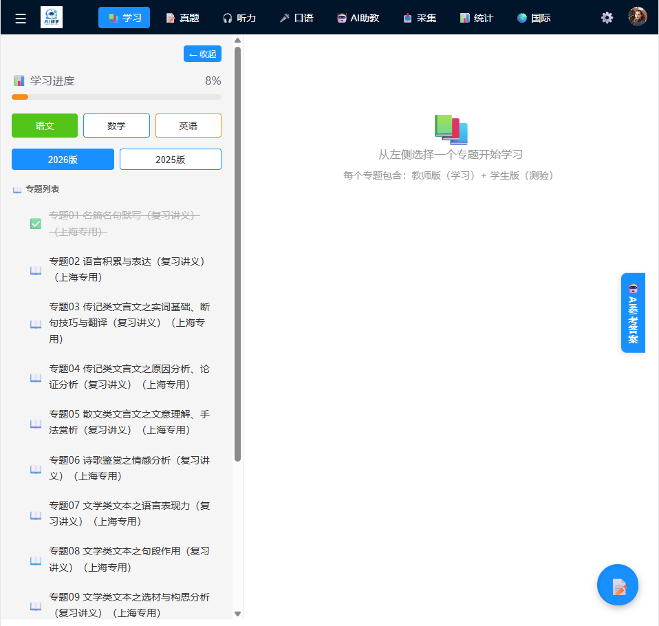
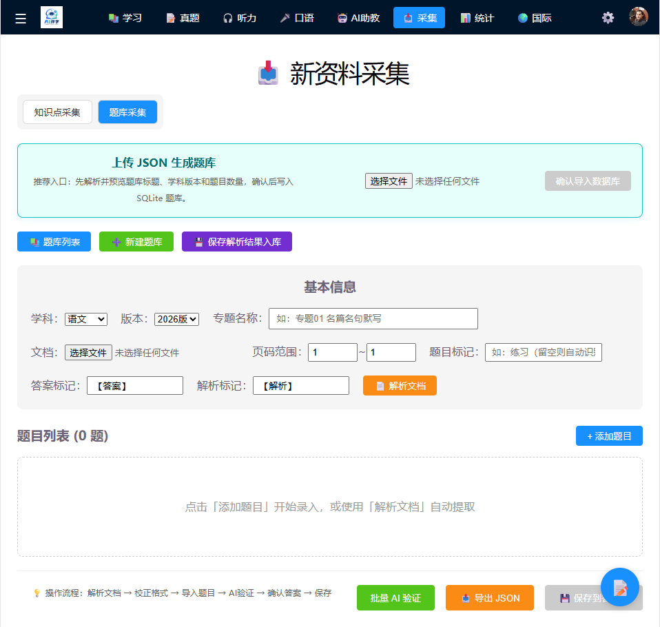
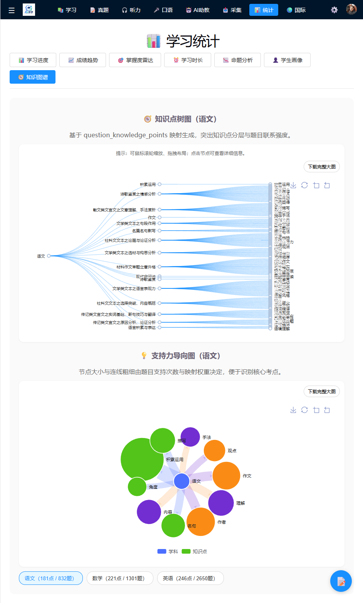
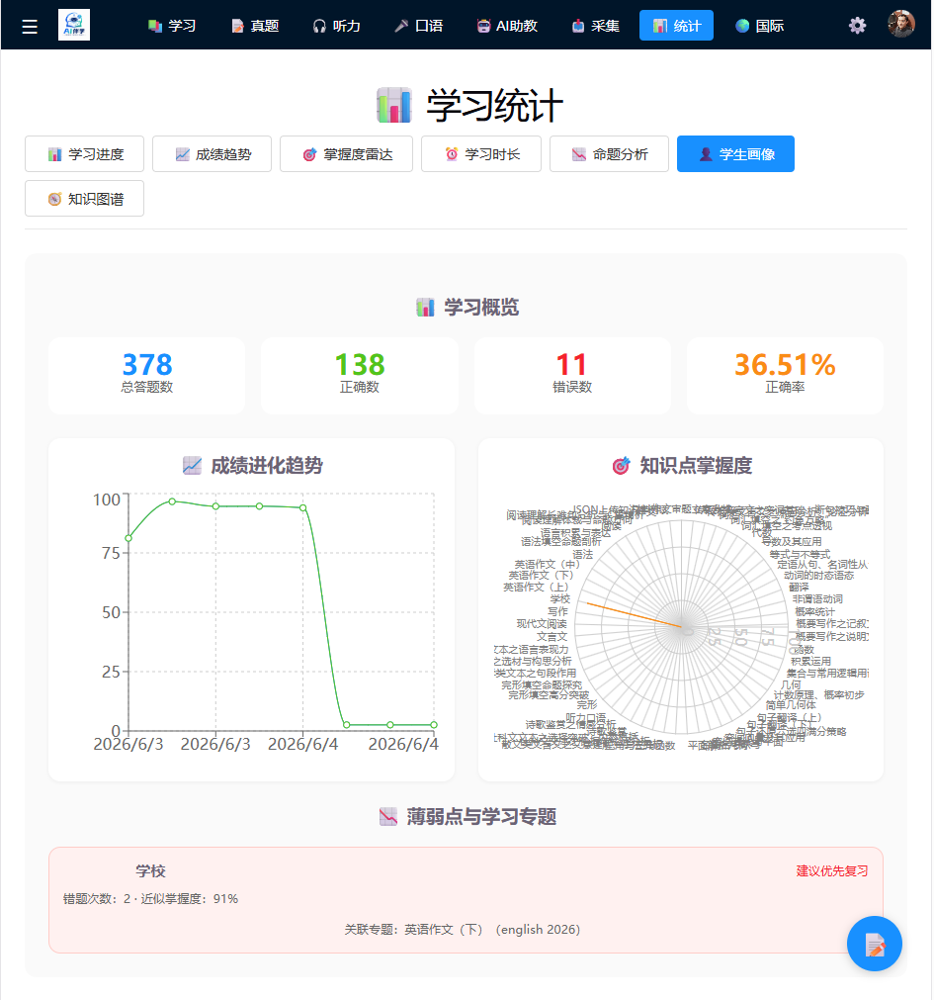
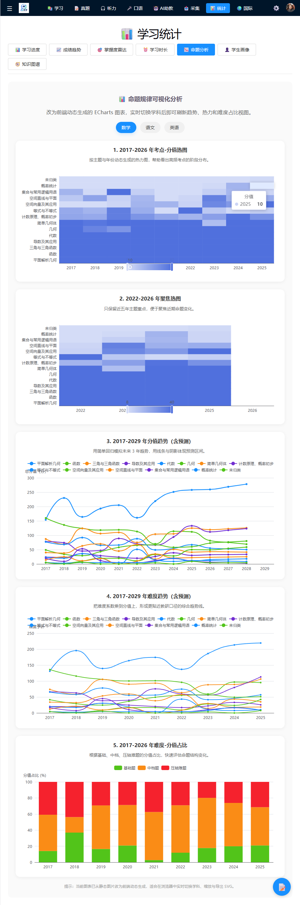

# AI伴学（AI Companion Learning）

> ⚠️ 暑期班招生中：我将在暑期开班，教学生如何部署这套系统，让每位学生把自己的学科资料导入进去，从此自己主导学习，不再依赖传统补习班的旧模式。  
> 想报名的同学请发邮件到：jd1370791@gmail.com  
> 目前仅有 5 个名额。

AI伴学是一个面向“任何学科、任何知识点”的开放式本地 AI 自学系统。
它不再局限于上海春考，而是将“资料采集 → 知识图谱 → 真题库 → 学员画像 → 提升建议 → 迭代学习”串成一套闭环的 AI 学习助手。

## 🎯 项目定位

这个系统的目标不是只做一套春考题库，而是构建一套可复用的 AI 伴学平台：

- 允许你把任意正在学习的教材、讲义、真题、题库资料导入系统；
- 自动提炼知识点并构建知识图谱；
- 建立题目与知识点的映射关系；
- 根据答题与学习表现，生成学员画像；
- 给出薄弱点、掌握度、复习建议与下一步学习路径；
- 通过不断迭代，形成一个真正能支撑持续学习的自学系统。

## ✨ 核心能力

- 资料采集与知识点导入
- 本地 AI 辅助解析与知识点抽取
- 题目 ↔ 知识点映射
- 知识图谱可视化
- 学员画像与掌握度雷达图
- 薄弱点分析与复习建议
- 真题库与学习进度管理
- 可本地部署，不依赖外部云服务

## 🔄 典型闭环流程

1. 导入课程资料、专题、真题或题库；
2. 从资料中抽取知识点并构建知识图谱；
3. 把题目与知识点关联起来，形成真题库映射；
4. 根据学习行为与答题记录生成学员画像；
5. 输出薄弱点、掌握度、复习建议；
6. 继续回到资料采集与学习迭代，逐步优化掌握效果。

## 🧩 适用场景

- 课程复习
- 真题训练
- 自主学习与知识点梳理
- 题库与知识图谱一体化管理
- 教师/学生/学习者的个性化学习分析

## 🖥️ 技术栈

- 前端：React + Vite + Recharts / ECharts
- 后端：Node.js + Express
- 数据库：SQLite
- AI：Ollama + 本地模型
- 脚本：Python

## 🚀 快速开始

### 1. 安装依赖

```bash
cd backend
npm install

cd ../frontend
npm install
```

### 2. 启动本地服务

```bash
# Windows
start.bat

# 或在前端目录运行
cd frontend
npm run dev
```

### 3. 访问系统

- 前端：http://localhost:5173
- 后端：http://localhost:3001

## 📁 项目结构

```text
ChunkaoCompanion/
├── backend/          # Node.js / Express 后端
├── frontend/         # React / Vite 前端
├── data/             # 资料、题库、知识图谱数据
├── docs/             # 开发记录、接口说明、架构说明
├── scripts/          # Python 辅助脚本
└── README.md
```

## 📸 系统截图

以下是当前项目的五张系统截图，可直接在 README 中查看：



首页总览页 — 展示学习入口、课程入口与整体系统导航。



资料采集页 — 展示如何导入教材、题库与学习资料。



知识图谱页 — 展示知识点之间的关联与结构化学习路径。



学习统计页 — 展示学生画像、掌握度与弱项分析结果。



命题规律分析页 — 展示命题趋势、题型分布与可视化分析结果。

## 📝 后续方向

- 更完善的知识点抽取与自动推荐
- 更强的学习画像与建议引擎
- 真题 / 题库 / 知识图谱联动闭环
- 更开放的课程导入与多学科扩展

## 📄 许可证

MIT License

## 👨‍💻 作者

Project maintained by deejoseph.